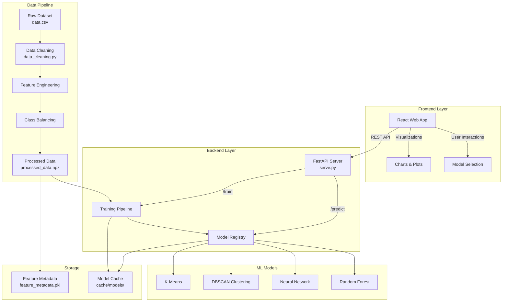

## Auris AI - Network Anomaly Detection

Detect unusual or potentially malicious network activity by distinguishing normal behaviour from anomalies using a mix of supervised, unsupervised, and deep learning models.


Live site: [auris-network-anomaly-detection-ai.vercel.app](https://auris-network-anomaly-detection-ai.vercel.app/)


## Quick Start

### Backend

```bash
cd Backend
python -m venv .venv
.\.venv\Scripts\activate
pip install -r requirements.txt

# (Optional): Preprocess data (creates processed_data.npz and feature_metadata.pkl)
python data_preprocessing\data_cleaning.py

# (Optional): Train and evaluate models (caches to Backend/cache/models)
python main.py

# Start API server
uvicorn serve:app --host 127.0.0.1 --port 8000 --reload
```
Backend SwaggerUI: `http://127.0.0.1:8000/docs`.

### Frontend

```bash
cd frontend
npm install
npm start
```
Front end URL: `http://127.0.0.1:3000`.
The frontend expects the backend at `http://127.0.0.1:8000`.

### Testing

**Backend Testing:**
```bash
cd Backend
pytest -q
```

**Test Coverage:**
- **Unit Tests**: Input validation (`test_validators.py`)
- **API Tests**: All endpoints with TestClient (`test_api.py`)
- **Integration Tests**: End-to-end prediction workflow
- **Error Handling**: 422, 404, 400, 500 status codes
- **Data Validation**: Non-negative inputs, 15-feature requirement

**Test Files:**
- `tests/conftest.py` - Pytest configuration and fixtures
- `tests/test_validators.py` - Unit tests for input validation
- `tests/test_api.py` - API endpoint integration tests

## Architecture



**Components:**
- **Frontend (React, `frontend/`)**: Web App for exploration, model selection, and visualisation (probabilities, confusion matrices, clustering views). Talks to the backend via REST.
- **Backend (Python/FastAPI, `Backend/`)**: Data preprocessing, training, model registry, and prediction API. Trained artefacts cached in `Backend/cache/models` and loaded at serve time.
- **Data pipeline (`Backend/data_preprocessing/`)**: Cleans https://ieeexplore.ieee.org/document/10262330 dataset, engineers features, balances classes, and persists `processed_data.npz` plus `feature_metadata.pkl`.
- **Serving (`Backend/serve.py`)**: Exposes endpoints (e.g., `/predict`) that the frontend calls during interactive testing.

## Code Structure

### Frontend (`frontend/`)
```
frontend/
├── public/                     # Static assets
│   ├── auris-bg.mp4            # Background video
│   ├── auris.gif               # Demo animation
│   └── *.png                   # Images and icons
├── src/
│   ├── components/             # React components
│   │   ├── about/              # About page components
│   │   ├── deep_learning/      # Deep learning visualization
│   │   ├── misc/               # Shared components (TopBar, Footer)
│   │   ├── supervised/         # Supervised learning charts
│   │   ├── testing/            # Model testing interface
│   │   └── unsupervised/       # Unsupervised learning views
│   ├── pages/                  # Page components
│   │   ├── About.jsx
│   │   ├── Deep_Learning.jsx
│   │   ├── Home.jsx
│   │   ├── Supervised.jsx
│   │   ├── Testing.jsx
│   │   └── Unsupervised.jsx
│   ├── api/                    # API client functions
│   │   └── predict.js          # Backend communication
│   ├── constants/              # Configuration
│   │   └── model_playground.js # Feature names and defaults
│   ├── App.js                  # Main app component
│   └── index.js                # Entry point
├── package.json                # Dependencies and scripts
└── build/                      # Production build output
```

### Backend (`Backend/`)
```
Backend/
├── serve.py                   # FastAPI application entry point
├── main.py                    # Training pipeline
├── config.py                  # Configuration settings
├── requirements.txt           # Python dependencies
├── services/                  # Business logic layer
│   ├── prediction.py          # Model loading and prediction
│   ├── features.py            # Feature preprocessing and scaling
│   ├── model_inspect.py       # Model architecture inspection
│   └── dataset_compare.py     # Dataset comparison logic
├── validators/                # Input validation
│   └── input.py               # Input validation functions
├── schemas/                   # Pydantic models
│   ├── predict.py             # Prediction request/response models
│   └── utilities.py           # Utility endpoint models
├── utils/                     # Utility modules
│   ├── model_io.py            # Model loading/saving
│   └── predict.py             # Prediction execution
├── data_preprocessing/        # Data pipeline
│   ├── data_cleaning.py       # Main preprocessing script
│   ├── create_balanced_dataset.py
│   ├── input/
│   │   └── data.csv           # Raw dataset
│   ├── output/
│   │   ├── processed_data.npz # Processed features
│   │   └── feature_metadata.pkl # Feature scaler and names
│   └── EDA/                   # Exploratory data analysis
├── evaluation/                # Model evaluation
│   ├── calc_eval_metrics.py
│   └── create_reports.py
├── evaluation_reports/        # Generated evaluation reports
├── cache/                     # Model cache
│   └── models/                # Trained model files (.joblib)
├── tests/                     # Test suite
│   ├── conftest.py            # Pytest configuration
│   ├── test_validators.py     # Unit tests for validators
│   └── test_api.py            # API integration tests
└── README.md                  # Backend documentation
```

## Part 1: Backend development:
Details: `https://github.com/Schnitze1/COS30049-Computing-Technology-Innovation-Project`